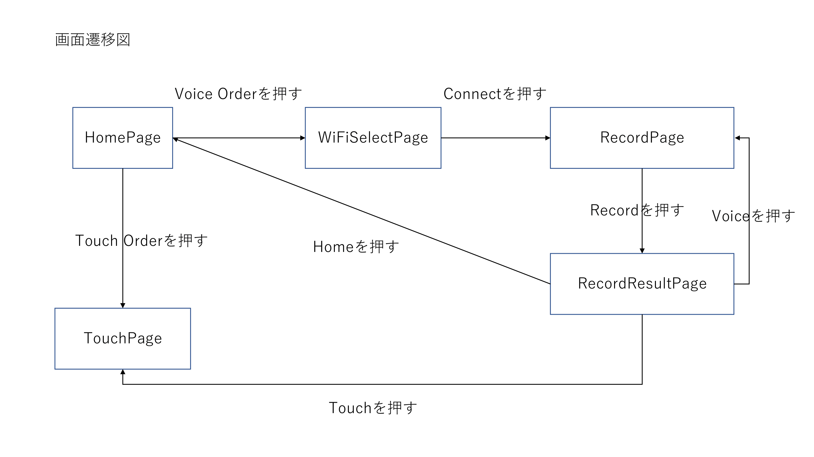

# Voice_Drone Andriod

### ・使用している端末
    Umidigi A3 Android 8.1.0

 

### ・開発環境
    AndroidStudio 4.0.1
    kotlin 1.3

 

### 主要なページに関する説明
1. HomePage \
    タッチでドローンを操作する(Touch Order)か音声でドローンを操作する(Voice Order)か選択できる

2. TouchPage \
    横画面でタッチ操作でドローンを操作するページ

3. WiFiSelectPage \
   ドローンのWiFiとインターネットWiFi( 音声認識するサーバーに接続するためのWiFi )を選択するページ

4. RecordPage \
    音声を保存するページ

5. RecordResultPage \
   音声認識されたデータの結果が返ってくるページ \
    このページでドローンが動く

 

### ・画面遷移図
 
